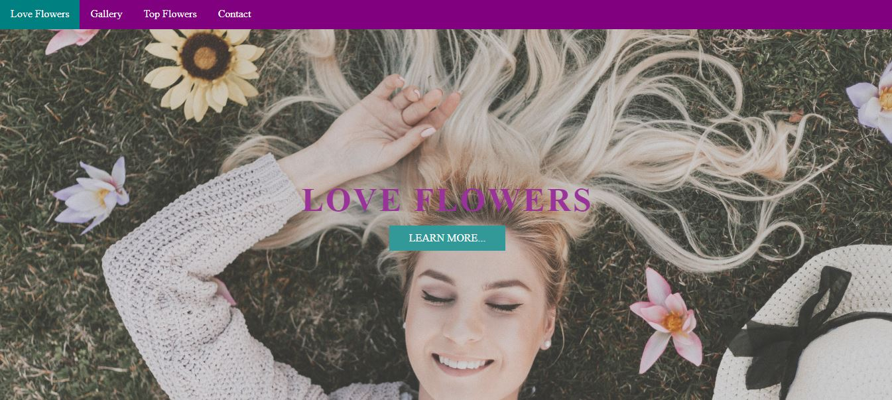
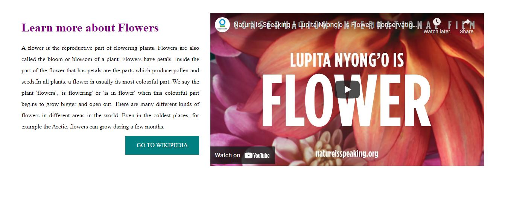
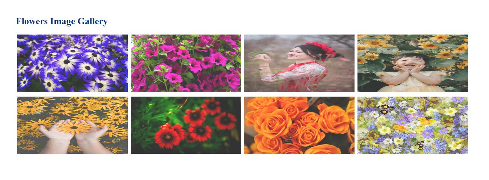
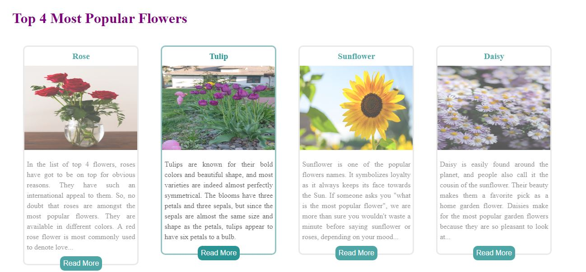
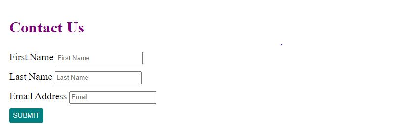

# love flowers

Love Flowers is a site that explores the popular flower types and makes nice feelings for flower lovers. Love Flowers is for those people who want to have a lot of flowers and know about them or who are interested in flowers. Love Flowers will be useful for people who want to get familiar with flowers of all popular types. 

### Existing Features

- __Navigation Bar__

   - Featured in all three sections, the full responsive navigation bar includes links to the Love Flowers, Gallery, Top Flowers,  and Contact Us section and is identical in each section to allow for easy navigation.
  - This section will allow the user to easily navigate from section to section across all devices.

- __The landing page image__

  - The landing includes a photograph with text overlay to allow the user to see exactly which location this site would be applicable to. 

- __Leran More About Flowers Section__

  - In this section, user can learn more about Flowers and it has a link to the  nuture is speaking for more information.

- __Gallery__

  - The gallery will provide the user with supporting images to see beautiful Flowers.

- __Top 4 Most Populare Flowers__

  - This page will allow the user to get familiar with  to  Populare Flowers in the world.

- __Contact Us section__

  - There is a forrm that contain input tags and take information from user, such as: First Name, Last Name and Email Address.
  - Also there is a submission button that conect to a return information  page.

- __Footer Section__

  - this section contain a copyright sign and  year that this webpage bulit.

### Testing
- I tested that this page works in different browsers: Chrome, Firfox, Safari.
 
- I confirmed that this project is responsive, looks good and functions on all standard screen sizes using the devtools device toolbar.
 
- I confirmed that the navigation, header, about Love Flowers, gallery, Top 4 most populare Flowers  are all readable and easy understand.

## Validator Testing 

- HTML
  - No errors were returned when passing through the official W3C validator.
- CSS
  - No errors were found when passing through the official W3C validator.
- Accessibility
     - I confirmed that the colors and fonts chosen are easy to read and accessible by running it through lighthouse in devtools.

      

## Technologies Used 

I have used several technologies that have enabled this design to work:

- [HTML](https://developer.mozilla.org/en-US/docs/Web/HTML)
    - Used as the basic building block for the project and to structure the content.
- [CSS](https://developer.mozilla.org/en-US/docs/Learn/Getting_started_with_the_web/CSS_basics)
    - Used to style all the web content across the project. 
- [JavaScript](https://www.javascript.com/)
    - Used for the responsive navbar, scroll down arrow and image gallery.
- [Google Developer Tools](https://developers.google.com/web/tools/chrome-devtools)
    - Used as a primary method of fixing spacing issues, finding bugs, and testing responsiveness across the project.
- [GitHub](https://github.com/)
    - Used to store code for the project after being pushed.
- [Gitpod](https://www.gitpod.io/)
    - Used as the development environment.
- [Grammarly](https://www.grammarly.com/)
    - Used to fix the thousands of grammar errors across the project.
- [Coloors](https://coolors.co/)
    - Used to create a colour palette for the design.
- [Fancybox](https://fancyapps.com/fancybox/3/)
    - Used to format my Sri Lanka photo gallery.
- [Color Contrast Accessibility Validator](https://color.a11y.com/)
    - Allowed me to test the colour contrast of my webpage.
- [W3C Markup Validation Service](https://validator.w3.org/) 
    - Used to validate all HTML code written and used in this webpage.
- [W3C CSS Validation Service](https://jigsaw.w3.org/css-validator/#validate_by_input)
    - Used to validate all CSS code written and used in this webpage.
- [AmIResponsive](http://ami.responsivedesign.is/)
    - Used to generate repsonsive image used in README file.

## Deployment

I deployed this website by using GitPages and following the below steps:

*GitHub pages deployment* 

1. Log in to GitHub
2. In your Repository section, select the project repository that you want to deploy
3. In the menu located at the top of this section, click 'Settings'
4. Select 'Pages' on the left-hand menu - this is around halfway down
5. In the source section, select branch 'Master' and save
6. The page is then given a site URL which The live link can be found here:      
     -https://zahramousavi612.github.io/Love-Flowers/

## Credits  

### Content 

- The text for the Learn more about Flowers was taken from WikiFlowers. [WikiFlower article](https://en.wikipedia.org/wiki/Flower)
- The text for the Top 4 Most Popular Flowers was taken from Wikipedia source.

### Media

- The photos used on the banner, gallery, 4 Top Flowers section are from This Open Source site: [pexels](https://www.pexels.com/)
- The video used on Learn more about Flowers was taken from this Youtube channel: https://www.youtube.com/watch?v=0_OxI2JZex4

## Acknowledgements

I would like to thank my course mentor Guido Cecilio for his support and guidance throughout the course of the project and my best friend Sediqa Mousavi for their support & feedback.
